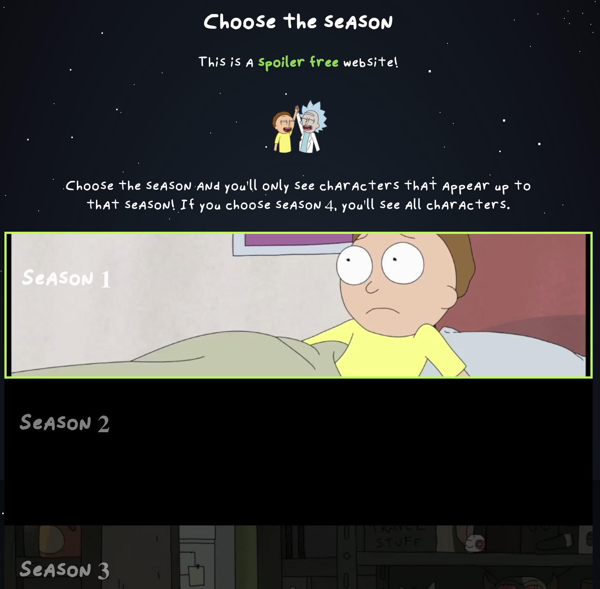
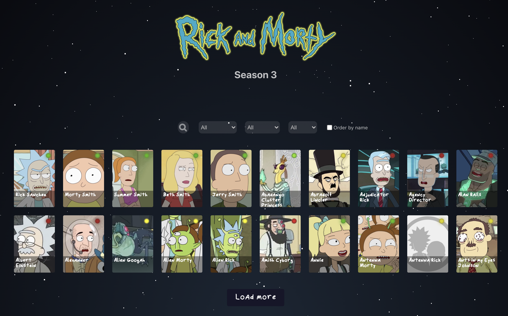
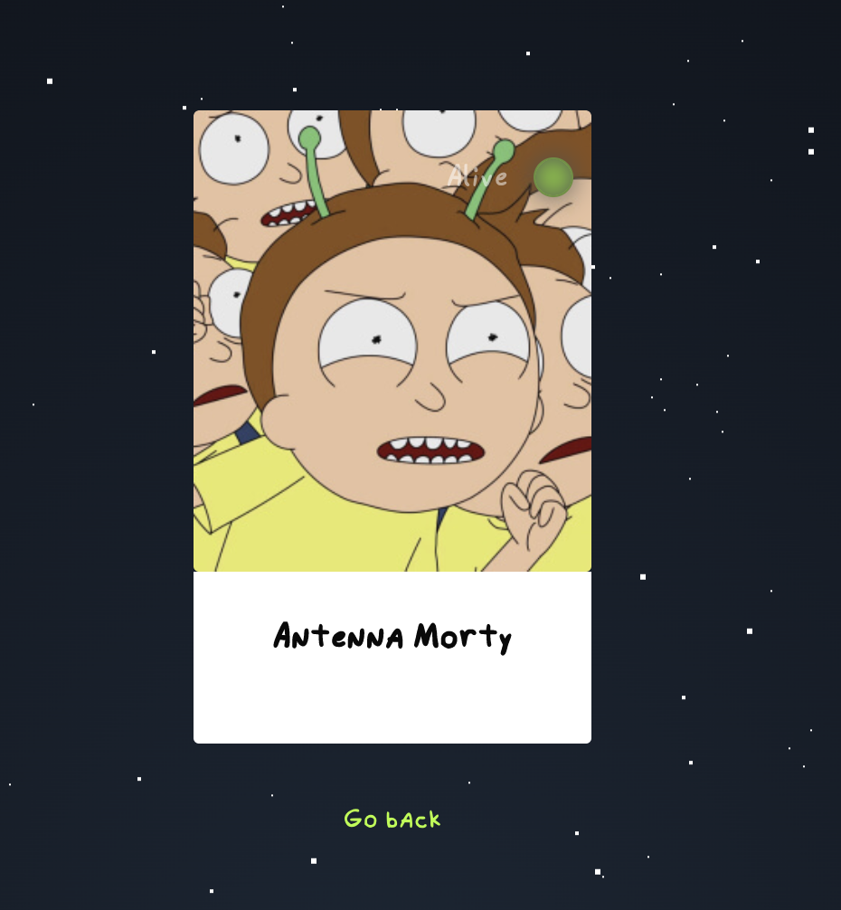
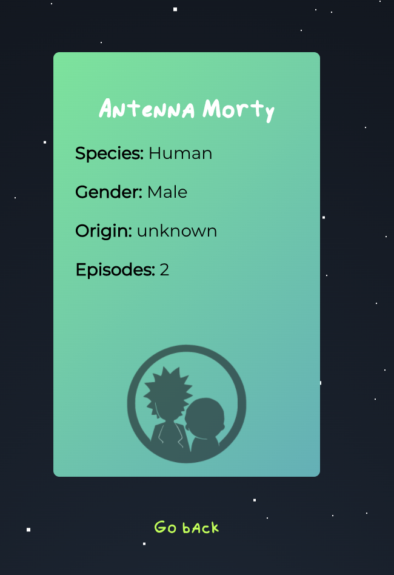

# Rick and Morty Character finder

   

1. [Objetivo](#Objetivo)
2. [Características](#Características)
3. [Instalación](#Instalación)

> ⚠️ **Esta página todavía no cuenta con una versión adaptada a dispositivos móviles.**

---

## Objetivo

El objetivo de esta aplicación web era crear un buscador de personajes de la serie Rick & Morty. En principio:

- se debían **mostrar los primeros veinte personajes** de la [rickandmortyapi](https://rickandmortyapi.com/documentation/).
- se debe poder hacer click sobre una tarjeta de personaje para que se nos muestre la **tarjeta con más información** (haciendo uso de **React router**)
- se debe poder **filtrar** los personajes por un input de texto
- se debe poder **ordenar** alfabéticamente los personajes

---

## Características

### Características técnicas

Para la realización de la página he manejado especialmente **React**, **javascript** y **css** (**sass**).

### Características de la página

#### El Landing

   

La página cuenta con un landing que nos muestra escenas de la serie. Al hacer click sobre el televisor, nos lleva a la sección de [temporadas](#Temporadas).

#### Temporadas

   

En la sección de temporadas podemos elegir una temporada para evitar spoilers. Si elegimos la temporada 1, no veremos personajes que aparezcan en temporadas más avanzadas.

> 👉🏻 **Este es un paso necesario.** Si el usuario intentara meterse a la sección de Búsqueda sin elegir una temporada, automáticamente la página lo redirigiría a la sección de temporadas.

#### Búsqueda

   

Una vez que accedemos a la sección de búsqueda veremos los 20 perimeros personajes.

> Nótese como la página nos indica debajo del título en qué temporada estamos.

En esta sección podemos:

- filtrar por nombre --> nos aparecerían TODOS (no sólo 20) personajes que coincidan con dicha búsqueda.
- filtrar por especie.
- filtrar por género.
- filtrar por estado (vivo, muerto, desconocido).
- ordenar los resultados alfabéticamente.
- pulsar sobre el botón "**load more**" carga más personajes en la página 
- pulsar sobre una tarjeta de personaje, para ver la tarjeta detallada

#### Tarjeta detallada

Al hacer hover sobre la tarjeta de personaje, la tarjeta se da la vuelta y nos muestra algo más de información sobre el personaje.

> El fondo de la tarjeta nos indica si:
>
> - está vivo: verde
> - está muerto: rojo
> - se desconoce: amarillo

Si pulsamos en el botón **Go back** nos lleva atrás.

### About 

En la sección about se puede ver una tarjeta con un dibujo estilo Rick & Morty de la autora, con información sobre ella y un link a su GitHub. Dibujo hecho a mano inspirado en el personaje de Tammy.

### El menú de navegación

   
   
   

El menú de navegación nos permite en todo momento navegar por las distintas páginas de la aplicación web. Muestra gifs de Rick & Morty al hacer hover.

## Instalación

1. Descargar el repositorio.

2. Tener instalado en el ordenador node

3. instalar las dependencias con `npm install`

4. correr `npm start`

   
   
   

---

Este proyecto ha sido diseñado y desarrollado por [Elena Martínez Marín](https://github.com/elemarmar). 
